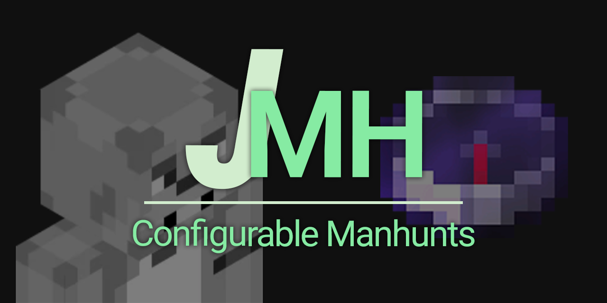

# JManhunt

JManhunt is a configurable Paper plugin for 26.2+ Manhunts.

Download: https://modrinth.com/plugin/jmanhunt

Contribute: https://github.com/jruk8/JManhunt

## Why JManhunt?

Compared to other plugins, JManhunt excels at configurability.

### Defaults
Almost everything in this plugin is configurable, but you don't have to
touch a single YAML file to get started. The default settings work out of
the box for anyone who just wants to start playing.

### Deep Configurability
Advanced users can toggle any default off and build a completely unique
Manhunt experience. The plugin is designed so that anyone comfortable with
vanilla Minecraft commands can figure out how to create custom modifiers
without much of a learning curve.

The commands-based approach keeps things modular and dependency-free.
Need something like a world reset between matches? Just pair JManhunt with
a plugin that handles that, and wire it into your game-state commands. There
is zero direct integration required.

If a feature you need doesn't exist yet, contributions are welcome on our
[GitHub page](https://github.com/jruk8/JManhunt). We're intentionally
keeping this plugin lightweight and modular, so please keep that philosophy
in mind when contributing.

## Getting started

1. Assign at least one hunter and one speedrunner:

   ```text
   /manhunt setplayer <selector> hunter
   /manhunt setplayer <selector> speedrunner
   ```

   Selectors such as `@a`, `@p`, and `@a[distance=..10]` are supported.
2. Start the match with `/manhunt start`.
3. Check the teams at any time with `/manhunt`.
4. The match ends when all speedrunners have died, or manually through
   `/manhunt end`.

Players need `jmanhunt.hunter` or `jmanhunt.speedrunner` to receive the
corresponding role. Both permissions are granted by default. The `/manhunt` 
is also accessible through the `mh` alias.

## Commands

| Command | What it does | Permission |
| --- | --- | --- |
| `/manhunt` | Shows the current teams and match status. | `jmanhunt.command.status` |
| `/manhunt help` | Shows the in-game command list. | `jmanhunt.command.help` |
| `/manhunt setplayer <selector> <role>` | Assigns `hunter`, `speedrunner`, or `none`. | `jmanhunt.command.setplayer` |
| `/manhunt start` | Starts a match. | `jmanhunt.command.start` |
| `/manhunt end` | Ends the active match; hunters win. | `jmanhunt.command.end` |
| `/manhunt modifiers [setting] [true\|false]` | Lists, views, or changes built-in actions and custom modifiers. | `jmanhunt.command.modifiers` |
| `/manhunt reload` | Reloads `config.yml` and `messages.yml`. | `jmanhunt.command.reload` |

## Custom modifiers

Custom modifiers are named command bundles in `config.yml` under
`custom-modifiers`. They are disabled by default. A modifier can run commands
when a match starts and when it ends, either from the console or once for each
participating player.

To enable a modifier, use its configuration name:

```text
/manhunt modifiers custom-modifiers.everyone-gets-beef true
```

The example modifier in the default config gives players food and applies
different commands to hunters and speedrunners. `perma-night` is another
example. You can also toggle a modifier by changing its `enabled` value in
`config.yml`, then running `/manhunt reload`.

When creating a modifier, copy the structure of an existing one. Currently
only manual YAML file editing is supported for creation. Commands can use
these placeholders:

| Placeholder | Replaced with |
| --- | --- |
| `<p>` | The participating player's name. Use this in player and role commands. |
| `<winner>` | Parses as `Hunters` or `Speedrunners` in end and cleanup commands. |

The available command lists are:

- `commands.player`: runs once for every participating player.
- `commands.hunter-commands`: runs once for every hunter.
- `commands.speedrunner-commands`: runs once for every speedrunner.
- `commands.console`: runs once from the console.
- `commands.console-cleanup`: runs when the match finishes.
- `commands.player-cleanup`: runs on every player when the match finishes.

For example:

```yaml
custom-modifiers:
  starter-kit:
    enabled: false
    commands:
      player:
        - "give <p> cooked_beef 8"
      hunter-commands: []
      speedrunner-commands: []
      console: []
      console-cleanup: []
      player-cleanup: []
```

## Extras
The plugin provides extra options for things that modify the game flow.
This includes things like:

- starting the game only when speedrunner hits a hunter
- autostart when enough players join
- custom bartering loot tables for higher ender pearl pulls
- dropping the compass on death so the speedrunner can track hunters
- optional grid-based world-engine runs with persistent spiral cell assignment,
  stronghold random spread, and automatic End resets between matches

and a lot more!

## Configuration

The plugin creates `config.yml` in its data folder. It includes match
behavior, default game actions, command bundles, custom modifiers, compass
refreshing, end-screen statistics, sounds, text formatting, and optional
PlaceholderAPI settings. Use `/manhunt modifiers` to browse and change the
boolean built-in actions and modifier switches in-game.
The `extras.world-engine` section controls grid cell size, spread radius,
target world, and lobby teleport location for the grid-based world engine.

The hunter compass cannot be dropped, stored in another container, moved by a
hopper, or transferred through inventory interactions. It is restored after a
hunter respawns.

## Statistics and PlaceholderAPI

Career statistics are enabled by default and stored in `jmanhunt.db` using SQLite.
The same database also stores the persistent world-engine spiral cell index.
For statistics shared between servers, set `database.type` to `postgresql` and
configure `database.postgresql` in `config.yml`.

With PlaceholderAPI installed, JManhunt provides placeholders such as
`%jmanhunt_total_kills%` and `%jmanhunt_formatted_time_as_hunter%`. The complete
list and formatting options are documented in `placeholders.yml`.

## Build

Java 25 is required. Gradle can use a locally installed matching toolchain.

```shell
./gradlew build
```

On Windows:

```powershell
.\gradlew.bat build
```

The plugin jar is written to `build/libs/`. GitHub Actions builds every push
and pull request. Pushing a `v*` tag creates a GitHub release and publishes to
Modrinth using the repository's `MODRINTH_ID`, `MODRINTH_GAME_VERSIONS`, and
`MODRINTH_TOKEN` settings.

See `CONTRIBUTING.md` for contributor setup.

© 2026 jruk8. Licensed under GNU GPLv3.
