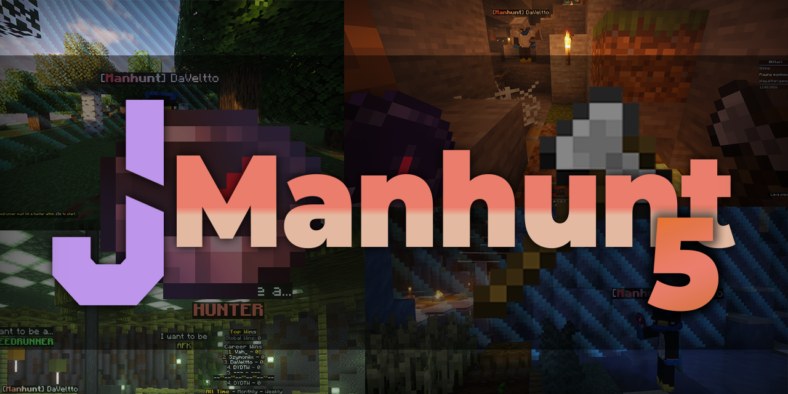
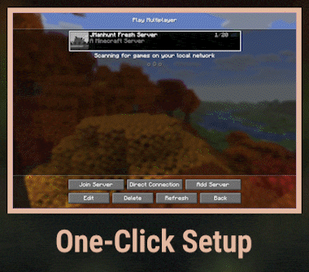
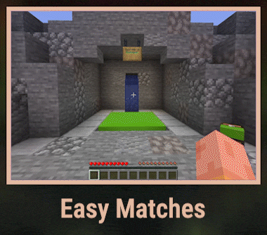
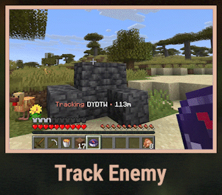
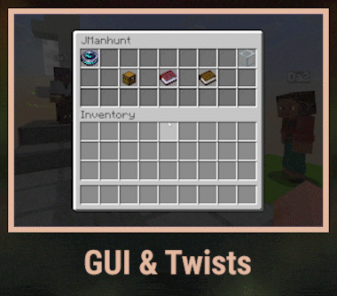

<h3>JManhunt is a deeply customizable plugin for 26.x Manhunts.</h3>

### [Modrinth](https://modrinth.com/plugin/jmanhunt) · [Community Mods](https://discord.com/invite/hkWmCVmWDC) · [Wiki](https://jruk8.github.io/JManhunt/)

 

<!-- Key Features Animated Section -->

### **Test server**: `play.alttari.games`

# Why Choose JManhunt?

### Instant World "Resets"

Most Manhunt plugins force full server restarts between matches. JManhunt solves this with a native **World Engine** that segments the world into near-infinite cells without server
restarts. This makes matches feel seamless for not only small friend groups, but also dedicated servers.

### Mods and Twists

The GUI allows you to one-click toggle between **20 default twists**. We also built a complete [JMHScript DSL](https://jruk8.github.io/JManhunt/configuration/modifiers/) to make modifier development easy. Simple ones like starting kits, random rolls, or basic status effects need no scripting (like `give 
 cooked_beef 8`). Mods can be written in-game through the **Modifier/Preset GUI** or through YAML.

Find these modifiers on our [**Discord**](https://discord.gg/hkWmCVmWDC) community forum:

- **Infection** » Dead runners become hunters on final death.
- **Huddle for Warmth** » Stay close to teammates or wither away.
- **Abilities** » Shift to invis, gapple on low health, blind nearby Hunters on
  kill...

# Features

- **One-click setup** » Get a World Engine lobby running **instantly**.
- **World Reset Engine** » Grid-based single-world engine with spiral cell assignment and end resets.
- **Compass tracking** » Fully tunable tracking compass with jamming, hotspots, and target cycling.
- **Concurrent matches** » Run multiple matches in parallel alongside our spectator system.
- **Mods** » Import community twists made with **JMHScript**, our DSL.
- **Also for serious deployment** » PostgreSQL stats, multiple game queues, per-lobby
  mod/setting overrides, disconnect handling, 280+ config settings, and team chat.

# Get Started 🗺️

1. Run **`/manhunt`** and click the **green button**.

**That's it!** Performant World Engine and parallel matches, all in one click. Alternatively, run `/manhunt setup` for a more intermediate dialogue-based setup.

### Requirements

- Server Software » [Paper](https://papermc.io/downloads/paper) **26.2+**
- Java Version » Java **25**
- Dependencies » **None**
- Soft Deps » [PlaceholderAPI](https://modrinth.com/plugin/placeholderapi) and [Chunky](https://modrinth.com/plugin/chunky) (or similar), plus [LuckPerms](https://modrinth.com/plugin/luckperms) for the `jmh-role` context

### Links

- [Discord & Community Mods](https://discord.gg/hkWmCVmWDC)
- [Modrinth](https://modrinth.com/plugin/jmanhunt)
- [Hangar](https://hangar.papermc.io/jruk/JManhunt)
- [Documentation](https://jruk8.github.io/JManhunt/)
- [GitHub](https://github.com/jruk8/JManhunt)

### Donate ☕

Developing JManhunt has taken me a lot of time and effort.
You can help support the upkeep and future of this plugin by making a [**small donation**](https://ko-fi.com/jruk). **Thanks!** 👐
