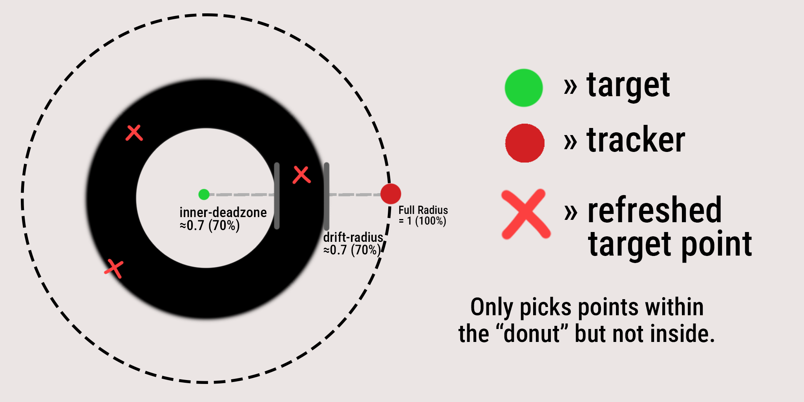
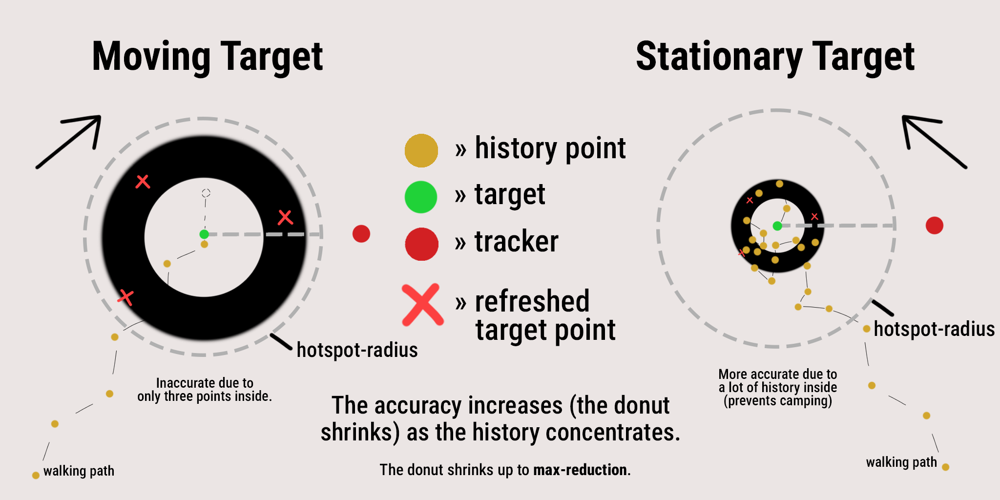

# Compass: Advanced

> For: advanced users tuning analysis, signal, and edge cases.

The deep end of [Compass](compass-tracking.md): analysis delays, signal
interference, inaccuracy drift, and the WorldEdit navwand toggle.

## Analysis Delay

A right-click refresh can take a purposeful moment to resolve instead
of answering instantly. Analysis is strictly right-click only:
automatic refreshes always resolve at once. While analyzing, the
actionbar reads `Analyzing...`, no second refresh can start, and
clicks are ignored until it resolves. Interference checks and distance
math use your press-time position, not where you moved to:

```yaml
actions:
  manual:
    analysis:
      enabled: true
      delay-seconds: 2.0
      delay-deviation-seconds: 1.0
```

`delay-seconds` is how long each analysis takes, and
`delay-deviation-seconds` adds a random plus-or-minus jitter per
analysis (capped at the delay, `0` for none). An analysis ends with
the refresh click sound on success, or the failure sound when the
needle lands on nothing trackable.

The compass must stay in the main hand for the whole run: switching
away cancels at once with a `Bad signal (cancelled)` readout.

### Analysis Debuffs

Console commands that run every time an analysis starts, in modifier
style: `<p>` is the compass holder, `~` resolves against their
location, and `<duration>` is the analysis delay in whole seconds
(floored). The `player` list runs for every analyzing holder plus
their own role list:

```yaml
debuffs:
  enabled: false
  commands:
    player:
      - "effect give <p> minecraft:slowness <duration> 1 true"
    speedrunner: []
    hunter:
      - "summon lightning_bolt ~ ~ ~"
```

### Analysis Cost

Each analysis can charge the holder in hunger, health, and
experience. `cost-on` picks when to charge: `INITIATE` at the press,
`SUCCESS` at the resolution, or `BOTH` at each. Each `payment`
container toggles separately:

```yaml
cost:
  enabled: false
  cost-on: INITIATE
  payment:
    saturation:
      enabled: false
      value: 3
    health:
      enabled: false
      value: 4
      can-kill: true
    exp-level:
      enabled: true
      value: 1
    failure-cooldown: 1.0
  poverty-behavior:
    cancel-when-poor: true
    show-reason: true
```

Saturation drains from a 0-40 hunger pool: hidden saturation first,
then the visible bar. Health drains in health points; `can-kill` lets
the charge kill, otherwise health never drops below half a heart.
Experience drains whole levels. A holder who cannot pay aborts with a
`Cost too high!` actionbar message when `cancel-when-poor` is on;
`show-reason` names each lacking charge. With cancelling off, the
holder pays whatever they have. At `SUCCESS`, a poor holder's result
is thrown away and the compass never updates. `failure-cooldown`
(seconds, `0` disables) holds further refreshes after a block.

### Cancel Early

An analysis that is already doomed finishes early instead of
running the full delay. `time-multiplier` (0 to 1) keeps that
fraction of the remaining time: `0` resolves at once, `1` leaves
the duration untouched.

```yaml
cancel-early:
  enabled: true
  time-multiplier: 0.3
```

## Signal Interference

Tracking can fail with a gray Bad signal readout when conditions are
bad. The master `enabled` switch defaults to on, with only the
`invisible` option on, so invisibility interferes out of the box
while everything else stays opt-in.

Each sub-option watches one thing (all default to off except
`invisible`):

- `light-level`: fails in the dark, with separate sky and block light
  minimums. Only applies in the overworld. `interfere-when` picks
  whether one unmet minimum is enough (`ONE_UNMET`) or both must be
  unmet (`BOTH_UNMET`, the default).
- `underground`: fails under too many solid blocks overhead. Glass,
  leaves, and other non-whole blocks do not count unless you turn
  `ignore-transparent` off.
- `underwater`: fails under too much water overhead, but only while
  the feet block itself is water. Works like `underground` but
  counts fluid blocks above the feet.
- `altitude`: fails outside a min/max height band.
- `weather`: fails during the listed weather (`STORM`, `RAIN`,
  `CLEAR`). Pick the values from the in-game checklist.
- `biome`: fails in the listed biomes, written as full keys like
  `minecraft:desert`.
- `movement`: fails when the refresher's longest displacement during
  the run passes `threshold-blocks` (default 0.2) from their press
  spot. Only fires on the analysis path, since instant refreshes
  have no gap to move in.
- `line-of-sight`: fails based on whether the holder can see the
  target. One eye-to-eye ray is checked; glass and leaves never block
  it. `interfere-when` picks the failing side (`VISIBLE` by
  default, `NOT_VISIBLE` for the opposite), and `max-ray-distance`
  (default 300) caps the ray: past it, there is no line of sight.
  Only live targets in the same world are checked.
- `invisible`: fails when a side is under the invisibility effect
  (on by default). Its `check-on` default of `BOTH` means either
  side's invisibility interferes.
- `player-stats`: fails when a side's stats run low.
  `health` fails below `min-health` health points (default 8, where
  20 is full vanilla health), `hunger` below `min-hunger` hunger
  bar levels (default 10), and `experience` below `min-exp-level`
  levels (default 5). Each has its own `check-on` key defaulting
  to `SELF`.

Every option except `line-of-sight` and `weather` has its own
`check-on` key: `SELF` checks only the holder's spot, `TARGET`
checks only the target's press-time spot, and `BOTH` checks each.
Light, movement, and the player stats default to `SELF`; the rest
default to `BOTH`. Weather is always holder-side only and has no
`check-on` key. Each side counts its failures against
`required-to-fail` (default 1), and `chance-to-bypass` gives a bad
signal a random chance to track anyway.

With `show-reason-in-actionbar` (default on), a bad signal names its
cause: `:( Bad signal (underground)`. When several options fail at
once, the most recently found one shows; the holder side wins ties.
The names come from the `compass.signal-reason` messages and can be
reworded there.

Interference works best with automatic refreshes off, analysis on,
and right-click refreshes on: instant refreshes leave no gap for
movement, doom, or stat changes to matter.

## Signal Inaccuracy

The compass can drift off the truth instead of failing outright.
Every refresh picks a random point inside a ring (a donut) around the
true spot: the ring grows with the true distance, so far targets read
fuzzier than near ones. Close range stays exact until the
`thresholds.min-distance` gate passes.



The sheet shows the defaults. The green dot is the true spot and the
red dot is the tracker at the full true distance. Each red X is one
refresh's picked point: every X lands somewhere in the black band,
never in the white hole, and never outside the band. The dashed circle
is the full true distance; `drift-radius` sets the band's outer edge
as a share of it, and `inner-deadzone` sets the white hole as a share
of that outer edge.

- `enabled` (default off) is the master switch.
- `inner-deadzone` (default 0.4) is the hole in the middle of the
  donut, from 0 up to (but not including) 1. At 0.5 no sample ever
  lands inside half the drift radius; at 0 the sample may land right
  on the true spot.
- `drift-radius` (default 0.6) is how far the readout may wander, as a
  share of the true distance. At 1 the error reaches up to the full
  distance away; near 0 it hugs the truth. It clamps to 0.01 at the
  bottom so the error never fully vanishes while enabled.
- `thresholds.min-distance` (default 100) is the range past which the
  error kicks in. Set it to -1 to always apply the error. It must stay
  below `max-distance` while max is set.
- `thresholds.max-distance` (default 1000) is the range past which the
  error stops growing: longer true distances reuse this range for the
  donut. Set it to -1 for unbounded growth.
- `inaccurate-on` (default BOTH) picks what drifts: NEEDLE moves only
  the needle, DISTANCE_FEEDBACK moves only the shown distance, BOTH
  moves both.

Two guardrails keep the drift honest. The needle only drifts on a
plain `compass` item: any other item has no settable needle. The
distance only drifts while a distance readout is visible. Scrolled
(cache-only) targets drift exactly like refreshed ones.

### Hotspot

Idling targets get easier to pin down: every `sample-interval`
seconds (default 10) the plugin records each live participant's spot,
keeping the last `max-points` spots (default 40). Players who are
offline, dead, respawning, or held for a headstart are skipped, and
nothing is recorded while a headstart countdown runs. Skipping never
erases what is already recorded. When many of a
target's saved spots sit within `hotspot-radius` meters (default 50)
of where they stand now, the error donut shrinks (the black band in
the sheet above narrows). Movers keep the full error.



The sheet compares both cases. The gold dots are the target's recorded
history along their walking path, and the dashed circle is
`hotspot-radius` around where they stand now. On the left the mover
has only three dots inside, which earns only partial credit, so the
donut stays wide. On the right the camper's history piles up inside
and the donut collapses. That is the anti-camping effect: idlers get
pinpointed while movers keep their cover.

`full-accuracy-fraction` (default 0.5) is the share of `max-points`
needed inside the radius for the full bonus, with partial credit
below that. `max-reduction` (default 0.9) is how much error the full
bonus removes. Saved spots disappear only when their player is
knocked out of the match for good, or when the match ends. Leaving
on your own, a short disconnect, a respawn, or losing a compass
keeps them.

## WorldEdit Navwand

WorldEdit teleports players who click with a compass, which fights the
tracking compass. `advanced.misc.interop.disable-worldedit-navwand`
(default on) blocks that teleport for compass clicks without needing
WorldEdit installed. Turn it off if you rely on the navwand.
