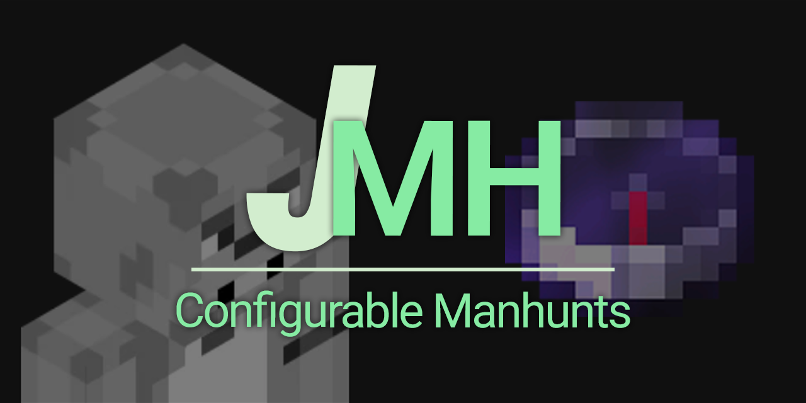

# Getting Started

## Requirements

- Paper 26.2 or newer
- Java 25

## Installation

1. Download the latest JManhunt jar from
   [Modrinth](https://modrinth.com/plugin/jmanhunt).
2. Place the jar in your server's `plugins/` folder.
3. Restart the server. JManhunt will generate its default configuration files
   in `plugins/JManhunt/`.
4. (Optional) Install [PlaceholderAPI](https://www.spigotmc.org/resources/placeholderapi.6245/)
   to use JManhunt's placeholders.

## Your First Match

1. Assign at least one hunter and one speedrunner:

   ```text
   /manhunt setplayer <selector> hunter
   /manhunt setplayer <selector> speedrunner
   ```

   Selectors such as `@a`, `@p`, and `@a[distance=..10]` are supported.

2. Start the match with `/manhunt start`.
3. Check the teams at any time with `/manhunt status`.
4. The match ends when all speedrunners have died, or manually through
   `/manhunt end`.

Players need `jmanhunt.hunter` or `jmanhunt.speedrunner` to receive the
corresponding role. Both permissions are granted by default. The `/manhunt`
command is also accessible through the `mh` alias.

## Next Steps

After playing a few matches, check out the built-in settings and custom
modifiers to enhance your experience:

- [Commands](commands.md)
- [Configuration](configuration.md)
- [Placeholders](placeholders.md)