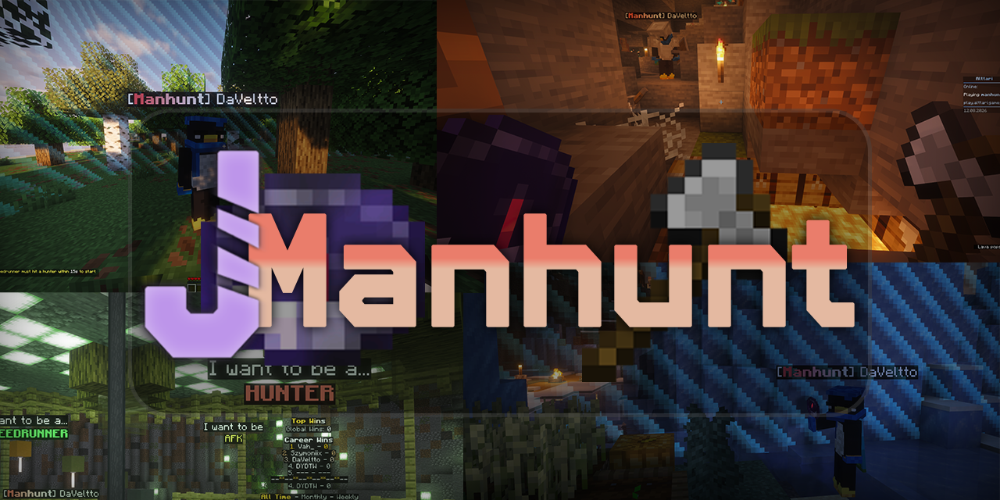

# Getting Started

> For: everyone setting up the plugin. Not installed yet? See [Installation](installation.md) first (two steps).

## Set up in one click

1. Run `/manhunt` in-game.
2. Click the green button.
3. Done. The Lobby System and the World Engine are both on, and your
   lobby is built.

You can start playing now, but restart soon so every new map has a
reachable End portal.

Rather be walked through it? Run `/manhunt setup` instead: same
systems, step by step, with preset and compass choices along the way.
Answer with a number, `b` to go back, `q` to quit.

On a survival server with normal play going on? Skip the green button:
it builds a separate lobby world and sets aside map areas for matches,
which only fits a Manhunt-only server. Playing without it means giving
up the automated part (fresh maps with zero commands after setup) and
the Lobby System, and playing with `/mh qs` in the main world instead.
Run `/manhunt setup` and pick the no resets route to get there.

## Play your first match

1. Pick teams: walk onto a colored pad in the lobby
   (lime = speedrunner, red = hunter), or run `/mh qs` to assign
   everyone at random.
2. Start with `/mh start` (or just wait, it starts on its own).
3. Check the match anytime with `/mh status`. End early with `/mh end`.

That's the whole loop.

## Once it gets stale

Played a few games and want a twist? Open `/manhunt` and try the
modifiers panel: kits, boosts, and game twists, no config needed.

## What's next?

- [Lobby System](play/lobby-system/index.md): bring players in, run matches.
- [Modifiers](configuration/modifiers.md): spice up the game.
- [Commands](play/commands.md): look up any command.
- [Configuration](configuration.md): change a setting.
- [Concurrent Matches](play/concurrent-matches.md): run several matches at once.
